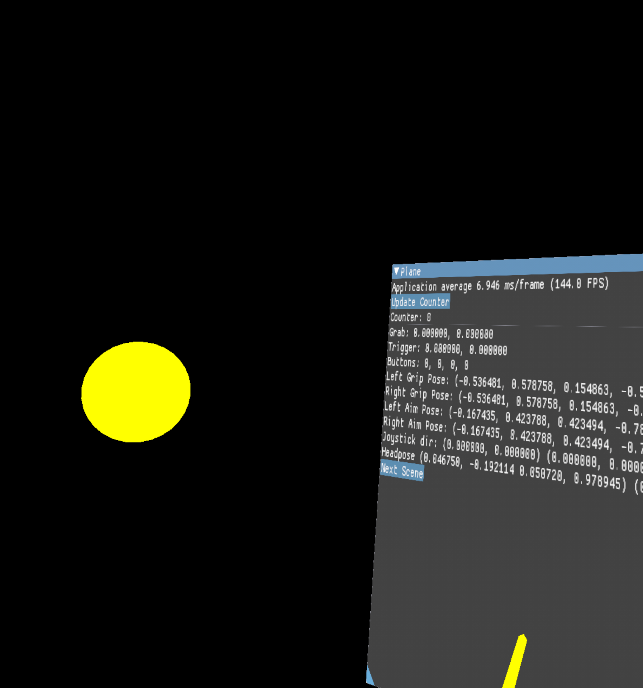

# ClayEngine Demo VR

Demo application of using the ClayEngine static library (https://github.com/VadimEngine/ClayEngine) to build a VR application with Android and OpenGLES. This application allows loading and using resources to build scenes that the use can navigate and interact with. This application primarily uses OpenXR from ClayEngine for the VR functionality

### Sandbox Scene

Sandbox scene renders rods at the user's controller's aim direction. A loaded 3d model with is rendered with a loaded texture. A sample string is rendered with a loaded font. And an Imgui window is rendered unto a plane and can be interacted with controller. The gui displays the user's controller and headset state. A sample audio can be played with a button and the scene can be swapped

### Space Scene

Similar to Sandbox scene but instead, a sun with an orbiting planet is rendered

### Build

build CLI:
- `./gradlew clean assembleDebug`
- `./gradlew clean build`

The build `app-debug.apk` will be `ClayEngineDemoVR\app\build\intermediates\apk\debug\app-debug.apk` can be deployed to an Oculus device

Alternatively, this can be built and deployed with Android studio.
